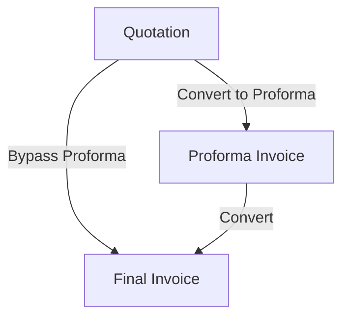

# Cashflow Billing ERP — User Manual

Welcome to **Cashflow Billing ERP**, a production-grade invoicing and billing dashboard tailored for **CASHFLOW SOLUTIONS**. This manual will guide you through the layout, document flows, and how to effectively manage your billing lifecycle.

---

## 1. Dashboard Overview

The home dashboard is divided into three key financial document metrics cards:

1. **Quotations (Blue)**: Tracks today's total quotation pipeline volume.
2. **Proforma Invoices (Yellow)**: Tracks pending proforma amounts.
3. **Final Invoices (Orange)**: Tracks today's confirmed revenue.

At the top right, the **Daily Workspace** tab displays active documents for the day, and **Archive & History** displays older documents. The **API Connection** indicator shows whether you are successfully connected to the billing database.

### Search and History View (Archive & History Tab)
Clicking the **Archive & History** tab allows you to search historical records by Document #, Client name, or email, showing total billed revenue metrics:

---

## 2. Document Creation & Client Registration

To create any document, click the **`+ Create`** button at the top-right of its respective table list.

### Selecting / Registering Clients
Inside the creation modal, you can select an existing registered client from the dropdown list, or register a new one inline by clicking **`+ New Client`**:

If you click **`+ New Client`**, the inline client registration form will expand. Fill in the client's information and click **`Save Client`**:

### Document Number Format
- Document numbers are automatically generated according to the Indian Financial Year format with dedicated document type prefixes:
  - **Quotation**: `2026-27/CFS-QT-001`
  - **Proforma**: `2026-27/CFS-PRO-001`
  - **Final Invoice**: `2026-27/CFS-INV-001`
  - These values auto-increment sequentially and update dynamically based on the current financial year.

### Optional Line Item Fields
- **Quantity (Qty)**: The quantity field is optional. If you leave it blank, calculations will treat it as `1` under the hood, but it will be printed as completely blank on your PDFs and invoices.
- **Disc (%)**: You can decide and type a custom discount percentage for each item. The system calculates subtotals and GST based on this discount.

---

## 3. The Document Lifecycle & Conversion Flow

To convert or view documents, use the buttons in the **Action** column or open the **Print Preview** modal.

### Action Icons Guide
- 🖨️ **Print Preview**: Opens a high-fidelity print preview window.
- ✏️ **Edit**: Edit any fields, clients, or items for draft documents.
- 🗑️ **Delete**: Permanently delete documents.
- ✅ **Convert (Green Checkmark)**:
  - On **Quotations**: Immediately converts the Quotation to a Proforma.
  - On **Proformas**: Immediately converts the Proforma to a Final Invoice.
- 💰 **Mark Paid (Golden Money Bag)**: On **Final Invoices**, marks them as `PAID`.

### Quotations Dashboard Section

### Proformas Dashboard Section

### Final Invoices Dashboard Section

---

## 4. Bypassing Proforma Invoices (Direct to Final Invoice)

Sometimes, clients bypass the Proforma step and proceed directly to a Final Invoice from a confirmed Quotation. You can achieve this in two ways:

### Method A: Direct Conversion via Print Preview
1. Click the 🖨️ **Print Preview** icon on any active Quotation.
2. In the footer of the print preview modal, click the blue **`Convert to Final Invoice`** button.
3. Confirm the prompt to immediately create a Final Invoice containing all details, bypassing the Proforma.

### Method B: Importing Quotation Details
1. Click **`+ Create`** on the **Today's Final Invoices** section.
2. In the creation form, find the **Import details from Quotation** dropdown.
3. Select your confirmed Quotation number. All client details, line items, and notes will automatically import, maintaining a link for the audit history.

---

## 5. Print Preview and PDFs

When you click the 🖨️ **Print Preview** button, the system displays a layout compliant with Indian Tally-style GST invoices:
- **Tax Breakdown**: Automatically calculates and separates **OUTPUT CGST & SGST** for local sales, or **OUTPUT IGST** for out-of-state sales based on client GSTINs.
- **Clean Discount Formatting**: Discount rates display cleanly as percentages (e.g. `5%` or `10%` instead of showing unnecessary trailing zeros like `10.000 %`).

### Saving & Printing Guidelines
To save your invoice or quotation cleanly as a PDF from Chrome/Safari:
1. Click the orange **`Print / Save PDF`** button.
2. In the system print dialog:
   - Set **Destination** to `Save as PDF`.
   - Set **Margins** to `Default`.
   - Toggle **Headers and footers** off (uncheck) to remove browser-generated page info (such as `localhost:3000` URLs and date stamps) from the print margins.
3. The file name will be automatically populated with the document's billing number (e.g. `2026-27-CFS-INV-005.pdf` or `2026-27-CFS-QT-005.pdf`), making organizing your documents effortless.

---

## 6. Signature Customization

The document template includes an official signature block for **CASHFLOW SOLUTIONS**:
- To display your signature on printed PDFs, upload a signature image file named either `signature.png` or `signature.svg` to the following folder:
  `apps/web/public/images/`
- The system will automatically detect the file. If both formats are missing, the signature area will remain cleanly hidden without displaying a broken image error.
